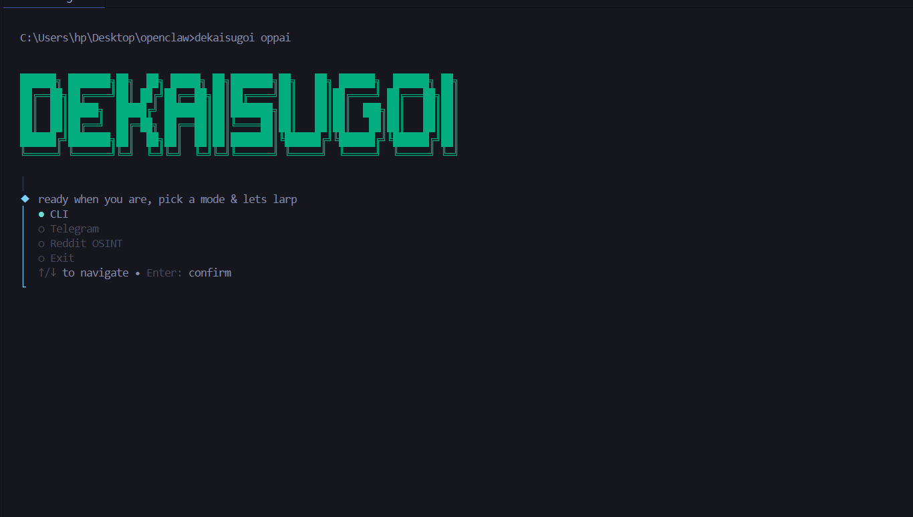
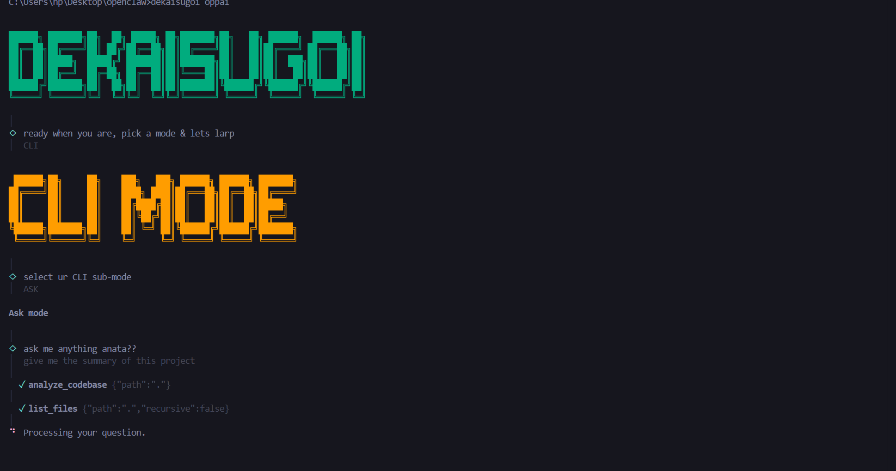
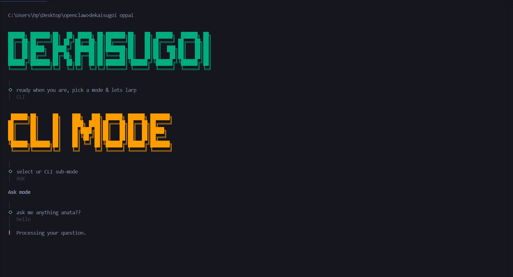
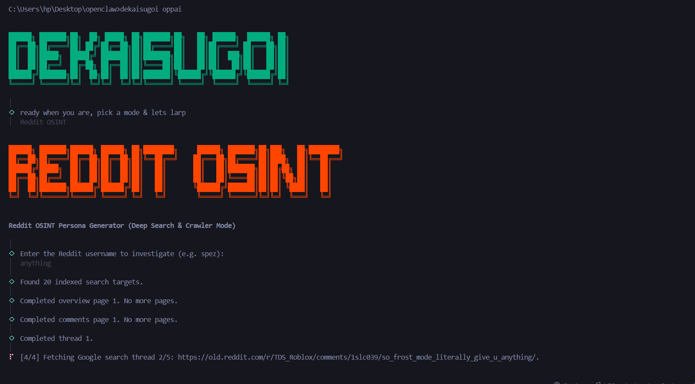
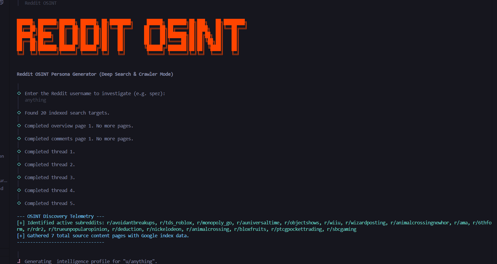

# SUGOIDEKAI

SUGOIDEKAI is a Bun-powered TypeScript CLI that launches a small multi-mode agent workspace. From one terminal entry point, you can open the interactive CLI, run planning and ask flows, connect a Telegram bot, or use the Reddit OSINT mode for username investigations.

## Preview



The start screen lets you choose between the CLI, Telegram, and Reddit OSINT modes from one place.

### CLI mode





### Reddit OSINT mode




### Telegram mode


## What it does

The project currently exposes these paths:

- `CLI` for interactive local work, with `agent`, `ask`, and `plan` sub-modes.
- `Telegram` for remote control through a bot.
- `Reddit OSINT` for username discovery, profile scraping, and thread collection.
- `Agent tools` for staged execution, approval, and filesystem-backed actions.

## Requirements

- Bun
- A valid OpenRouter API key for model-backed flows
- A Firecrawl API key for plan and Reddit OSINT workflows
- Telegram bot credentials if you want to run the Telegram mode

## Setup

1. Install dependencies.

```bash
bun install
```

2. Create a local environment file from the example.

```bash
cp .env.example .env
```

3. Fill in the values you need.

```env
OPENROUTER_API_KEY=
OPENROUTER_DEFAULT_MODEL=
FIRECRAWL_API_KEY=
TELEGRAM_BOT_TOKEN=
TELEGRAM_BOT_ID=
SKILLS_DIRS=
```

## Run

Start the main launcher:

```bash
bun run start
```

Or run the CLI entry directly:

```bash
bun index.ts oppai
```

Or we can it directly like sugoidekai oppai

```bash
bun link 
```
run above code in terminal and it will give u the further steps

The launcher then shows the mode picker from [tui/wakeup.ts](tui/wakeup.ts) and routes into:

- [modes/cli.ts](modes/cli.ts)
- [modes/telegram/index.ts](modes/telegram/index.ts)
- [modes/reddit/index.ts](modes/reddit/index.ts)

## Available scripts

- `bun run start` starts the app.
- `bun run dev` runs the same launcher for local development.
- `bun run cli` starts the interactive launcher.
- `bun run typecheck` runs a TypeScript check without emitting output.

## Environment variables

- `OPENROUTER_API_KEY` powers the agent model provider in [ai/ai.config.ts](ai/ai.config.ts).
- `OPENROUTER_DEFAULT_MODEL` selects the default model.
- `FIRECRAWL_API_KEY` enables Reddit OSINT and web-backed planning.
- `TELEGRAM_BOT_TOKEN` and `TELEGRAM_BOT_ID` are required for Telegram mode.
- `SKILLS_DIRS` is optional and is used by the tool executor for skills discovery.

## Repository layout

- [index.ts](index.ts) is the CLI entrypoint.
- [ai/](ai) contains model-provider configuration.
- [modes/](modes) contains the CLI, planning, Telegram, ask, Reddit, and agent flows.
- [tui/](tui) contains terminal UI helpers.
- [images/](images) stores screenshots used by the project.

